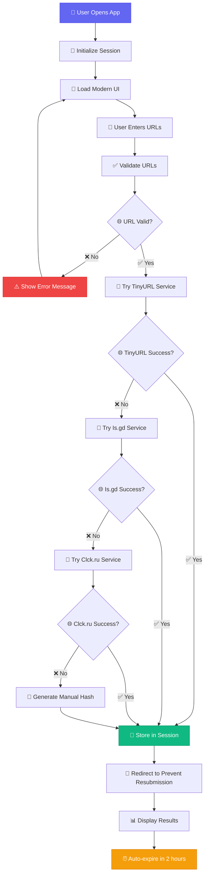
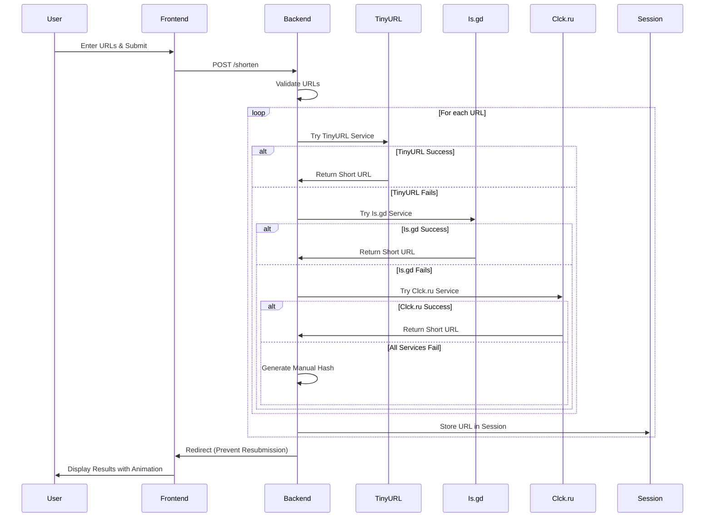

# 🚀 TinyURL Pro - Modern URL Shortener

<div align="center">


**A sleek, modern, and privacy-focused URL shortener with session-based storage**

[](https://python.org)
[](https://flask.palletsprojects.com)
[](https://html.spec.whatwg.org)
[](https://www.w3.org/Style/CSS)
[](https://developer.mozilla.org/en-US/docs/Web/JavaScript)

[🌐 Live Demo](#-getting-started) • [📖 Documentation](#-features) • [🤝 Contributing](#-contributing)

---

### ✨ **Transform your long URLs into powerful, trackable short links**


</div>

## 🎯 **What is TinyURL Pro?**

TinyURL Pro is a **modern, privacy-focused URL shortener** built with Flask that features:
- 🔒 **Session-based storage** (2-hour auto-expiry)
- 🌙 **Dark/Light theme toggle**
- 📱 **Fully responsive design**
- ⚡ **Multiple shortener services** as fallbacks
- 🎨 **Modern glassmorphism UI**
- 🔍 **Smart search functionality**
- 📊 **Real-time statistics**

## 🌟 **Key Features**

<table>
<tr>
<td width="50%">

### 🔐 **Privacy First**
- ✅ Session-based storage (no permanent database)
- ✅ 2-hour auto-expiry for URLs
- ✅ User-specific URL history
- ✅ No cross-user data sharing
- ✅ Perfect for temporary shortening

</td>
<td width="50%">

### ⚡ **Performance & Reliability**
- ✅ Multiple shortener services (TinyURL, Is.gd, Clck.ru)
- ✅ Automatic fallback system
- ✅ Retry mechanism with timeout handling
- ✅ Manual hash-based backup shortener
- ✅ Real-time error feedback

</td>
</tr>
<tr>
<td width="50%">

### 🎨 **Modern UI/UX**
- ✅ Dark/Light theme with smooth transitions
- ✅ Animated particle background
- ✅ Glassmorphism design elements
- ✅ One-click copy to clipboard
- ✅ Loading states and animations
- ✅ Toast notifications

</td>
<td width="50%">

### 📱 **Developer Friendly**
- ✅ Easy deployment (no database setup)
- ✅ Lightweight and fast
- ✅ RESTful API endpoints
- ✅ Clean, documented code
- ✅ Responsive design for all devices

</td>
</tr>
</table>

## 🚀 **Getting Started**

### **Prerequisites**
```bash
Python 3.8+ installed on your system
```

### **Quick Setup**

1. **Clone the repository**
   ```bash
   git clone https://github.com/bruhat15/TinyURL--Url-Shortner.git
   cd TinyURL--Url-Shortner
   ```

2. **Install dependencies**
   ```bash
   pip install -r requirements.txt
   ```

3. **Run the application**
   ```bash
   python app.py
   ```

4. **Open your browser**
   ```
   http://127.0.0.1:5000
   ```

🎉 **That's it!** Your URL shortener is now running!

## 📋 **Project Structure**

```
TinyURL--Url-Shortner/
├── 📄 app.py                 # Main Flask application
├── 📋 requirements.txt       # Python dependencies
├── 📁 Templates/
│   └── 🌐 index.html        # Main HTML template
├── 📁 Static/
│   ├── 🎨 style.css         # Modern CSS styles
│   └── 🖼️ bg2.jpg          # Background image
└── 📖 README.md             # Project documentation
```

## 🔄 **How It Works - Complete Workflow**

<div align="center">



</div>

## 🛠️ **Technical Deep Dive**

### **🔧 Backend Architecture**

<details>
<summary><strong>🐍 Flask Application Structure</strong></summary>

```python
# Core Components:
├── Session Management (Flask-Session)
├── URL Validation System
├── Multi-Service Shortener Engine
├── Error Handling & Retry Logic
├── RESTful API Endpoints
└── Security & Privacy Controls
```

**Key Functions:**
- `initialize_session()` - Sets up user session with 2-hour expiry
- `shorten_url()` - Multi-service URL shortening with fallbacks
- `clean_session_history()` - Auto-cleanup of expired URLs
- `add_to_session()` - Session-based URL storage

</details>

<details>
<summary><strong>🎨 Frontend Architecture</strong></summary>

```css
/* Modern CSS Features Used: */
├── CSS Grid & Flexbox Layouts
├── CSS Variables for Theming
├── CSS Animations & Transitions
├── Responsive Design Patterns
├── Glassmorphism Effects
└── Dark/Light Theme System
```

**Key Features:**
- Animated particle background
- Smooth theme transitions
- Mobile-first responsive design
- Interactive hover effects

</details>

### **🔄 URL Shortening Workflow**



## 🎮 **Interactive Features**

### **🌙 Theme Toggle**
Click the moon/sun icon in the header to switch between dark and light themes with smooth animations.

### **📋 One-Click Copy**
Every URL has a copy button that:
- Copies URL to clipboard
- Shows visual feedback
- Displays toast notification

### **🔍 Smart Search**
- Search by campaign name
- Real-time filtering
- Clear search functionality
- Maintains search state

### **⚡ Real-time Feedback**
- Loading spinners during processing
- Success/error flash messages
- Progress indicators
- Smooth transitions

## 🌐 **API Endpoints**

| Method | Endpoint | Description |
|--------|----------|-------------|
| `GET` | `/` | Main application interface |
| `POST` | `/` | Process URL shortening or search |
| `POST` | `/delete/<id>` | Delete specific URL from session |
| `GET` | `/clear-search` | Clear search results |
| `GET` | `/api/stats` | Get session statistics (JSON) |

### **📊 Stats API Response**
```json
{
  "total_urls": 5,
  "unique_campaigns": 3,
  "session_age_hours": 0.25,
  "expires_in_hours": 1.75
}
```

## 🎯 **Use Cases**

<table>
<tr>
<td><strong>🎓 Students & Researchers</strong></td>
<td>Share academic papers, resources, and project links temporarily</td>
</tr>
<tr>
<td><strong>💼 Business & Marketing</strong></td>
<td>Create campaign-specific short links for social media and emails</td>
</tr>
<tr>
<td><strong>👨‍💻 Developers</strong></td>
<td>Share GitHub repos, documentation, and demo links quickly</td>
</tr>
<tr>
<td><strong>🌐 Content Creators</strong></td>
<td>Shorten links for video descriptions, social posts, and portfolios</td>
</tr>
<tr>
<td><strong>🔒 Privacy-Conscious Users</strong></td>
<td>Temporary URL shortening without permanent data storage</td>
</tr>
</table>


### **Customization Options**
- **Theme Colors**: Edit CSS variables in `style.css`
- **Session Duration**: Modify `app.permanent_session_lifetime`
- **Shortener Services**: Add/remove services in `shorten_url()` function
- **UI Components**: Customize HTML templates and CSS

## 🤝 **Contributing**

We welcome contributions! Here's how you can help:

1. **🍴 Fork the repository**
2. **🌿 Create your feature branch**
   ```bash
   git checkout -b feature/AmazingFeature
   ```
3. **💻 Commit your changes**
   ```bash
   git commit -m 'Add some AmazingFeature'
   ```
4. **📤 Push to the branch**
   ```bash
   git push origin feature/AmazingFeature
   ```
5. **🔀 Open a Pull Request**

### **🐛 Bug Reports**
Found a bug? [Open an issue](https://github.com/bruhat15/TinyURL--Url-Shortner/issues) with:
- Bug description
- Steps to reproduce
- Expected vs actual behavior
- Screenshots (if applicable)

### **💡 Feature Requests**
Have an idea? We'd love to hear it! [Suggest a feature](https://github.com/bruhat15/TinyURL--Url-Shortner/issues) with:
- Feature description
- Use case/motivation
- Implementation ideas (optional)

## 📝 **License**

This project is licensed under the MIT License - see the [LICENSE](LICENSE) file for details.

## 🙏 **Acknowledgments**

- **Flask Team** - For the amazing web framework
- **PyShorteners** - For URL shortening service integration
- **Font Awesome** - For beautiful icons
- **Inter Font** - For clean typography
- **CSS Tricks** - For modern CSS techniques
- **MDN Web Docs** - For web development references

## 📊 **Project Stats**

<div align="center">


</div>

## 🚀 **What's Next?**

- [ ] **Analytics Dashboard** - Track click statistics
- [ ] **Custom Domains** - Support for branded short links
- [ ] **QR Code Generation** - Generate QR codes for short URLs
- [ ] **API Rate Limiting** - Implement rate limiting for API endpoints
- [ ] **Bulk Import** - CSV/Excel file upload support
- [ ] **Link Expiry Options** - Custom expiration times
- [ ] **Password Protection** - Optional password-protected links

---

<div align="center">

**Made with ❤️ by [Bruhat15](https://github.com/bruhat15)**

⭐ **Star this repo if you find it helpful!** ⭐

[🌐 Live Demo](https://tiny-url-shortner-sooty.vercel.app/) • [📧 Contact](kulkarnibruhat@gmail.com) • [💼 LinkedIn](https://www.linkedin.com/in/bruhat15)

</div>
